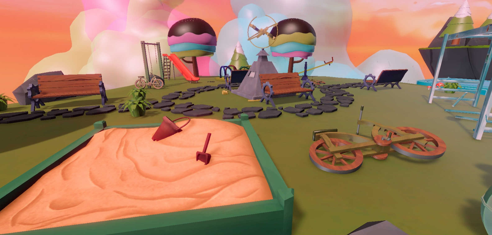
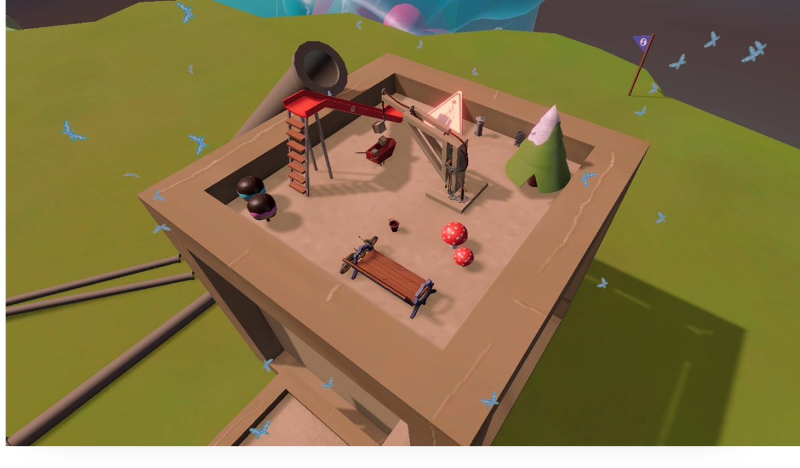
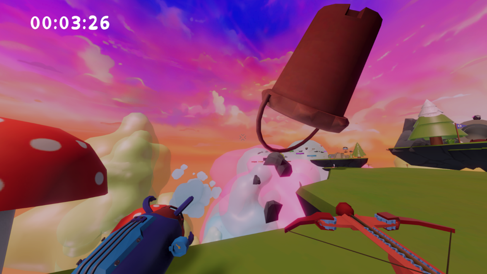

# Somnia

**Somnia** is a 3D movement–focused platformer developed in Unity. The game emphasizes fluid, parkour-style traversal through levels using a combination of acrobatic maneuvers and special movement abilities.

---

## Table of Contents

1. [Description](#description)  
2. [Features](#features)  
3. [How to Play](#how-to-play)  
   - [Controls](#controls)  
   - [Mechanics Overview](#mechanics-overview)  
4. [Installation & Requirements](#installation--requirements)  
5. [Project Structure](#project-structure)  
6. [Screenshots](#screenshots)  
7. [Contributing](#contributing)  
8. [Contact](#contact)  

---

## Description

Somnia is a fast-paced 3D platformer that rewards mastery of movement. You’ll navigate custom levels, chain together swings, air blasts, wallruns, and dashes to overcome obstacles and reach the goal. Extra movement features like coyote time, air strafing, slide, and bunny hop mechanics ensure that every run feels responsive and dynamic.

---

## Features

- **Swing**: Attach to nearby grapple points and swing across chasms.  
- **Air Blast**: Push yourself backward or deflect projectiles with a burst of air.  
- **Dash**: Instantly accelerate in the facing direction for quick bursts of speed.  
- **Wallrun & Walljump**: Automatically run along walls when you approach them—press Jump during wallrun to launch off in the opposite direction.  
- **Slide**: Hold the Crouch key (Ctrl) to slide beneath low obstacles.  
- **Coyote Time**: A short grace period after leaving a ledge during which you can still jump.  
- **Air Strafe**: Control your direction mid-air for precision movement.  
- **Bunny Hop**: Chain jumps together rapidly for increased momentum.  

---

## How to Play

### Controls

| Action       | Key / Input            |
| ------------ | ---------------------- |
| Move         | **W / A / S / D**      |
| Jump         | **Space**              |
| Swing        | **Left Mouse Button**  |
| Air Blast    | **Right Mouse Button** |
| Dash         | **Left Shift**         |
| Crouch/Slide | **Left Ctrl**          |
| Pause/Menu   | **Esc**                |

- **Wallrun** is automatic when you move toward a wall while airborne.  
- **Walljump**: During a wallrun, press **Space** to jump off in the opposite direction.  

### Mechanics Overview

1. **Swing**

   - Aim your reticle.  
   - Press **Left Click** to shoot a grappling hook.  
   - Hold **Left Click** to swing.

2. **Air Blast**

   - Press **Right Click** while airborne to generate a burst of air.  
   - The air blast applies knockback to yourself (or objects), allowing you to change your momentum mid-air.  
   - Ammo is reloaded when you shoot designated targets or touch the ground.

3. **Dash**

   - Press **Left Shift** to dash in the direction you’re facing.  
   - Dash and Air Blast share a single ammo; there is no separate cooldown for dashing.  
   - Using Dash consumes your only ammo, forcing a choice between dashing or spending ammo to reload by shooting targets or touching the ground.  
   - Dashing consumes a short cooldown—use it to clear gaps or evade obstacles.

4. **Wallrun & Walljump**

   - While airborne, if you approach a wall at a shallow angle, your character will automatically stick and begin wallrunning.  
   - Press **Space** during a wallrun to walljump: you’ll be propelled off at a fixed angle.  
   - **Walljump Coyote Time:** Even if you slightly miss the wallrun window, you have a short grace period (~0.2 seconds) to press **Space** and still perform a walljump.

5. **Slide**

   - Hold **Left Ctrl** while moving to slide under low obstacles.

6. **Coyote Time**

   - After running off a platform, you have a brief window (~0.2 seconds) to still press **Space** and jump.  
   - Makes platforming more forgiving and maintains flow.

7. **Air Strafe**

   - While airborne, use **A / D** (or move stick) to slightly adjust your trajectory.  
   - Allows fine-tuning of landings and line-of-sight for grappling.

8. **Bunny Hop**

   - Consecutive jumps without touching the ground increase movement speed.  
   - Tap **Space** upon landing to maintain momentum.

---

---

## Media

### Video Demo

https://www.youtube.com/watch?v=1-3QZizhhnA
